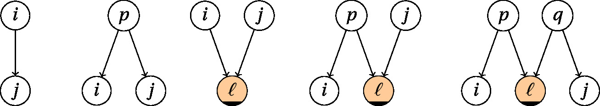

## $*$-separation
```@docs
    star_separation(H::Graph{Directed}, i::Vertex, j::Vertex, K::Vector{Vertex})
```

## $C^*$-separation
Let $(G, C)$ be a weighted DAG with vertex set~$V$ and \(L \subseteq V\). 
The *critical DAG* $G^\ast_{C,L}$ is the DAG on $V$ such that $i \to j$ whenever $i$ and $j$ are 
connected via a directed path, and no critical path from $i$ to $j$ in $G$ intersects $L$.

Two nodes $i$ and $j$ are $C^\ast$-connected given $L$ if there exists a path from 
$i$ to $j$ in $G^\ast_{C, L}$ of the following form 
where an orange node is called a *collider* and must belong to $L$.
If no such path exists, then $i$ and $j$ are *$C^\ast$-separated given $L$*
which is denoted $[i\perp_{C^*} j \mid L$.
```@docs
    cstar_separation(G::Graph{Directed}, C, i::Vertex, j::Vertex, K::Vector{Vertex})
    cstar_separation(G::Graph{Directed}, W::AbstractVector{<:RingElement}, i::Vertex, j::Vertex, K::Vector{Vertex})
    cstar_separation(G::Graph{Directed}, i::Vertex, j::Vertex, K::Vector{Vertex})
```

## Maxoids
For a directed graph $G$ on $d$ nodes with weights given by a vector $W\in\mathbb{R}^E$ or by a matrix $C\in\mathbb{T}^{d\times d}$,
we call the collection of $C^*$-separation statements the *maxoid* of $(G,C)$.
```@docs
    maxoid(G::Graph{Directed}, C)
    maxoid(G::Graph{Directed}, W::Vector{<:RingElement})
```

There is also function to output a maxoid in a compact representation suitable for 
processing with a SMT solvers or the likes.
```@docs
    ci_string(G::Graph{Directed}, C)
```

We also provide functions to list all maxoids arising from a graph or a family of graphs.
```@docs
    all_maxoids(G::Graph{Directed}; generic_only = false)
    all_maxoids(G::AbstractVector{Graph{Directed}}; generic_only = false)
```

These functions also exist for the same type of output from `ci_string`.
```@docs
    all_maxoids_as_ci_string(G::Graph{Directed}; generic_only = false)
    all_maxoids_as_ci_string(G::AbstractVector{Graph{Directed}}; generic_only = false)
```
